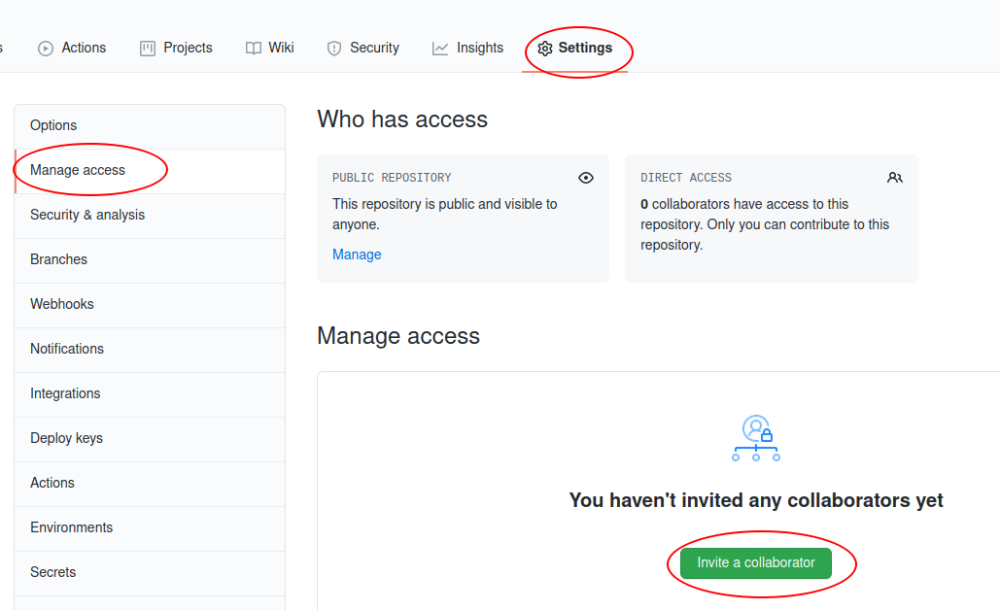
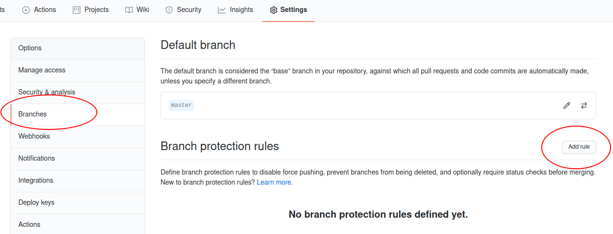
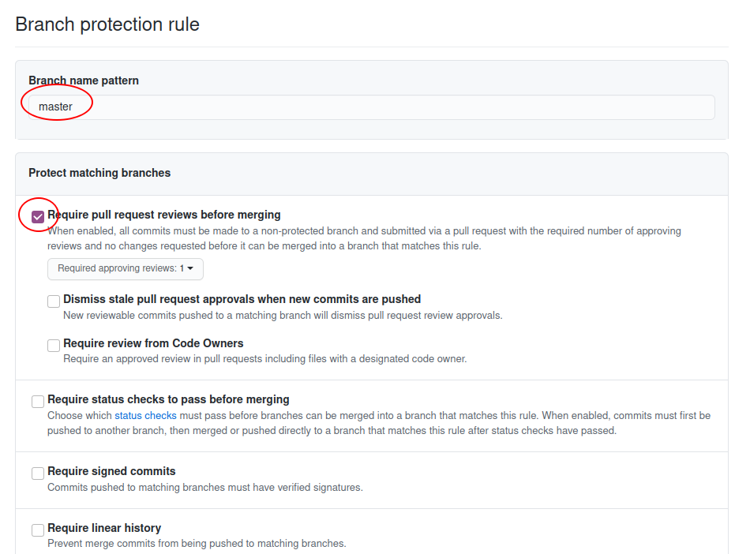
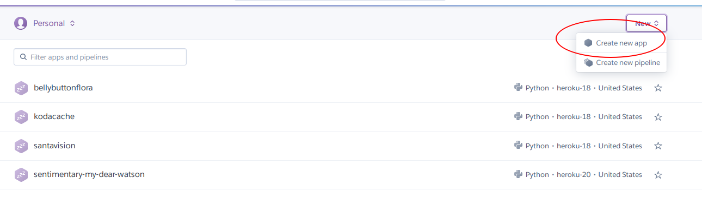
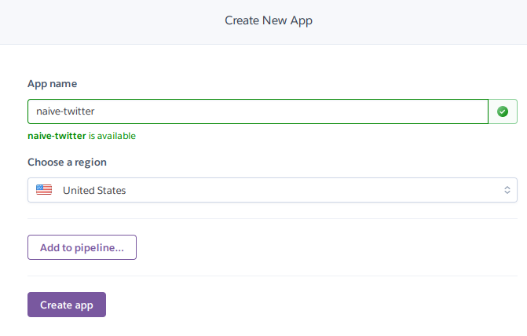
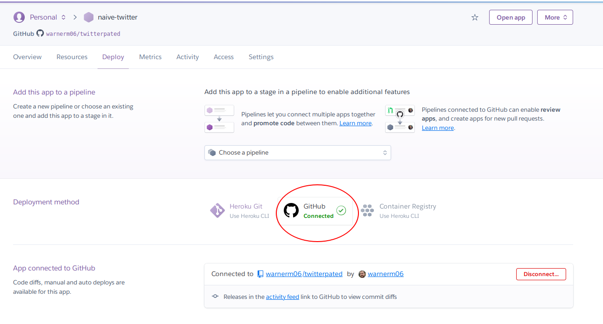
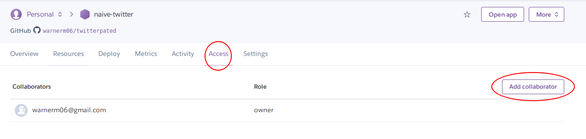

### Create a Web App that Analyzes Tweets
A challenge Data Scientists have is sharing the fruits of their labor. What good is a model if it only lives in one person's notebook? One solution to this problem is to create a web app that takes user input and gives back the preditions. In large companies Data Scientists would hand off their models to other teams and let them worry about implementation. Small companies and hobbyists have no such luxury. Fortunately creating a web app can easily be done before breakfast. So let's get started and create a web app that performs sentiment analysis on tweets! 

###  This is a Group Activity
Coding and git is a group activity. If you want to learn git you need to work with other people. Working solo and only commiting to `master/main` will not get you very far. This assignment is HARD. It's hard because we have a lot to cover and there are many ways to make mistakes. Git is forgiving because you can recover from most mistakes but it's difficult because mistakes are easy to make. So start early and help each other out! 


Each group should have 3 members. If your group does not please work among yourselves to decide who takes on what responsibilites. The instructions specify who does what in an effort to share the load and have less confident members handle simpler tasks. Feel fee to abandon the delegations and share the work as you see fit. Just make sure the work gets done and work is shared equitably. 

#### Note about `master/main`
Many companies are moving away from the term `master` in favor of `main`. This tutorial will use the term `master` because it is most likely what you have installed on your local machine. `master` and `main` are only interchangeable with specific versions of software and configurations. 

Feel free to use `main` if it works for your team. You will likely have addiitonal configuration for your local git repository as well as Heroku.  Please post a How-To on Slack if your team configures your app to use `main` so that others may benefit. 
### Solo Activity
**Pre-Work** *Start Early!*

To get started the pre-work will be solo but you can collaborate on this too if you wish. Each person should complete the following materials: 
* [Corey MS Git](https://www.youtube.com/playlist?list=PL-osiE80TeTuRUfjRe54Eea17-YfnOOAx) (Entire Series Edit:Videos 4&5 are optional. You don't need to download DiffMerge tool.)
* [Flask Tutorial](https://www.youtube.com/playlist?list=PL-osiE80TeTs4UjLw5MM6OjgkjFeUxCYH) (Only videos 1 and 2)
* Read through the rest of these instructions. 
* Reach out to team members and make a plan of action on how to get the assignment done. 
    * When to meet(if needed)?
    * Who will do what? 
    * What happens if someone falls behind? 
    * What will you do if you get stuck? 

# The Assignment
0. Some instructions are very precise and others are more open ended. This is intentional. We want you to develop your git skills! Take it slow and take the time to understand what you are doing. Also, look out for mistakes in the instructions. We did his best we could to create a meaningful project for you. Unfortunagely there may be some mistakes or not so clear instructions. 
    * When in doubt:
        * Google
        * Ask help from your teamates
        * Ask help on Slack
1. Each portion of the assignment will have a recomended student to perform the activty. A tasks are harder than B tasks and C tasks are the simplest. Decide amongst yourselves who does what. Again, you can abandon the recomendations if desired. It would be beneficial to work through this assignment together instead of doing each part solo. 

2. Each student should copy the files in 'starter' into their own folder(does not need to be a repo). Please refer to the finished product as needed. Run and understand the following notebooks in this order:
    1. `train_tweet_classifier.ipynb`
        * This is a cleaned up version of previous homwork. Pay particular attention to the `pickling` section. 
    2. `test_tweet_classifier_pickle.ipynb`
        * This notebook just tests our model to make sure we can use the `pickled` version. 

3. Student A should create a new empty repo. It can have a Readme if you want. Invite Your team members to this repo. 
    * All members should accept invite. 
    * **Edit** You must have a file in the repo for the 'branch' option to show up. Create a file in `master` and push it to the remote repo.
    
    * Go to Settings > Branches and click 'add rule'
    * Under Branch Name patter put `master`
    * Select Require pull requests before merging
    * Click Create Rule
    * Click Save Changes 
        * This requires the person who set up the repo to approve the code before it can be merged into `master`
        * This acts as a quality control gate
        * We will remove this check in futre steps but it's good to see how it's done in production
    

    * Add a branch protection rule to `master`
    
    * Alert the other members of the group that the repo is ready. 
4. Everyone should clone the repo. 
    * As you are working think through the process. There is a remote repo on Github and one local copy per team member. 
5. Student B should navigate to the repo and create a branch called `dev`. This branch will be a copy of `master`. 
    * Switch to the `dev` branch. 
        * Only student B will see this branch. You have to push this branch to the remote repo if you want others to see it. It's not necessary for what we are doing in this step. But you could! 
    * Create a file called `app.py` in the repo. Place the following code in the file. 

        ```
        from flask import Flask

        app = Flask(__name__)

        @app.route('/')
        def home():
            return 'Hello World!'


        if __name__=='__main__':

            app.run(debug=True)
        ```
    * in a terminal run `python app.py` to run the app. 
    * Navigate to `127.0.1:5000` in your browser to see the app. This is also called `localhost:5000`. 
    * Save your file.
    * Ctrl + c will kill the server and return your prompt.
    * Commit your changes. 
    * Checkout `master` branch. 
    * Do a git pull to get any changes on master. **ALWAYS** do a git pull on master before merging changes. This gives you the latest version of `master`.
    * Do a git merge to bring in the `dev` branch changes. 
    * Git push to the remote repo. 
        * You may get an error and have to follow the recomendations on setting upstream origin. 
    * You should have gotten an error about requiring approvals.This is due to the protected branch.
    * Checkout your `dev` branch and push it to the remote repo
    * In github.com create a pull request
    * Student A will need to approve the pull request and merge the changes. 
    * Confirm changes have been merged to `master`
    * Delete your local `dev` branch and remote branch if you created one. 
6. Student A should receive a pull request in their email and/or on github. 
    * Most companies don't allow everyone to commit to master so we will simulate that for the first few steps. This acts as a safeguard against bad commits bringing down your produciton apps. 
    * View the pull request in github and accept it if it looks good. 
    * In github click on `Pull requests > the open pull request > view changes. 
        * You should see the code that was added/changed. It will have green and/or red highlights
    * Click on Approve and/or Merge.
    * Be sure the changes have been merged
7. Student C will create an about page. 
    * In your clone of the repo perform the following: 
    * Do a git pull to see the changes to `master`. 
    * Run the app to make sure everything still works. 
    * Create a new branch called `about`
    * Switch to the `about` branch
    * Add the following code **below** the `home` route. 
        * Your file should look like `starter/flask02.py`
    ```
    @app.route('/about')
    def about():

        about_text = """
        Fill in some info about the project here.
        """
        return about_text

    ```
    * Save files and run the app. 
        * `localhost:5000/about`
    * Commit your changes to the `about` branch. 
    * Checkout `master` branch. 
    * Merge your `about` branch into `master`.
    * Push your changes to the remote repo.
    * Delete your local `about` branch.
8. Student A should inspect and accept the pull request in github. 
    * Edit permissions to allow all to commit to master. 
        * Go to Settings > Branches
        * Delete the Branch protection rule
        * Now anyone can commit to master
    * Student A will not longer be the gatekeeper. 
9. Student A will edit the app to accept GET requests and return the arguments to the page. 
    * Do a git pull on `master` branch. 
    * Run the app to make sure it works and see the about page
    * Crete a branch called `requests` and switch to that branch
    * add `from flask import request` to the top of the file
    * Edit the `home` route to match the following code. The `app.py` file should look like `flask03.py`.
    ```
    @app.route('/')
    def home():

        # if request has args (?tweet=some_tweet)
        if request.args:

            # get the value of the arg
            tweet = request.args.get('tweet')   
            
            return tweet

        return 'Hello World!'
    ```
    * Save your file and run the app. 
    * Navigate to `localhost:5000/?tweet=some sweet tweet`
        * Your arg must be `tweet` or it will fail. The value can by anything. 
    * Checkout the `master` branch do a git pull. 
    * Merge your changes into master. 
    * Push changes to the remote repo. 
    * Delete the local `requests` branch
10. Student B will render an html page
    * Do a git pull on `master` branch
    * Confirm all routes work as expected
    * Create a branch called `html`
    * Switch to `html` branch and add a folder called `templates`
    * Inside the folder create a file called `index.html`
    * Place the contents of `starter/index01.html` into the file
    * add this to the top of `app.py`
        * `from flask import render_template`
    * Change the `home` route to match the following
    ```
    @app.route('/')
    def home():

        return render_template('index.html')
    ```
    * Save files and run the app
    * Your app now uses html!
    * Merge `html` into master and push master to the remote repo
    * Remove the local `html` branch

11. Student C will edit the app so that we can pass arguments from Flask to the html template. 
    * Do a git pull on the `master` branch
    * Create a branch called `args`
    * Switch to `args` branch and make the following edits
    * Make hte `home` route match `starter/flask05.py`
    * Edit the `p` tag inside the html body to match `index02.thml`
    * Save your work and run the app.
    * Change the value of `my_arg` in flask to something else. 
    * Save and reload the page. See the changes? 
    * Commit your your changes. 
    * Switch to `master` and do a git pull
    * Merge `args` into `master
    * Push `master` to the remote repo
    * Delete the local `args` branch
12. Student A will create an `analyze` route to allow POST requests
    * This will allow users to submit a form.
    * On `master` do a git pull
    * Create a branch of your choice and switch to it
    * Edit the `home` route to match `starter/flask06.py`
    * Edit the imports to match `starter/flask06.py`
    * Add the `analyze` route and mak `app.py` match `flask06.py`
        * You are adding a new route that will process the tweets
    * Run the app
        * No changes will be visible. We have not edited the HTML yet. 
    * Save and merge changes with `master`.
    * Push `master` to the remote repo
13. Student B will edit `index.html` and create a form
    * Create a new branch of your choice
    * Switch to that branch
    * Edit `index.html` to match `starter/index03.html`
    * Run the app and you should see a form!
        * It will crash because you are missing a file.
    * Merge your branch into `master`
    * Push `master` to the remote repo
    * Remove the local branch
14. Student C will add our missing `joblib` file. 
    * On `master` do a git pull
    * Create a branch
    * Copy the `tweet_classifier.joblib` file from the prework into the this branch
    * Save, and checkout `master`
    * Merge in your changes
    * Run the app. It should work now!
    * Push `master` to the remote repo.

15. All Students:
    * At this point the app should have a form that accepts user input
    * You should be able to get a pos/neg predition. 
    * Everyone should be able to run this app locally. 
    * If anyone is behind work to catch them up to this point. 

### Heroku

Congrats on getting a web app to run locally! Now it's time to share you app with the world. 

0. A lot of documentation shows developers working with the Heroku CLI (command line interface). For this tutorial everything you need is available via the GUI and your github repo. I would not recommend using the CLI until after you have deployed your app. 

1. Student A go to [heroku](https://heroku.com) and create an account. 
    * Create an App. 
    
    
    * Follow prompts to connect to github and select your repo
    
    * Enable automatic deploys and click Deploy Branch
        * This causes changes to `master` to be automatically propagated to the app
    * Watch the build in the gray box
        * Build may fail because we don't have all the files yet
    

    * Add saboteurs... I mean collaborators. :-) 
        * And give appropriate permissions (if needed)
    
    * Please leave this app up if your colabs do not create their own. 
        * Don't delete it for ~6 months. This is part of your collaborators portfolio and they should have the ability to showcase their work.

2. Student C will added necessary files for heroku to run.
    * Create a branch called `heroku` and switch to it
    * Copy the following files from `starter/` into your appstarted by user warnerm06@gma
        * `Procfile`, `requirements.txt` and `start.py`
    * Merge your branch into `master`
    * Push `master` to the remote repo
    * Delete the local branch
3. All Students
    * Go to the heroku app url and see your app! 
    * Make a change and merge into master. 
        * Watch the build! 
    * You can view logs for troubleshooting under `More> View Logs`
    

Optional: Please continue to work together on optional additions.
1. Customize your app any way you want. 
2. Each person could create their own heroku app. 
3. There's plenty of green field to explore after this week. :-) 


